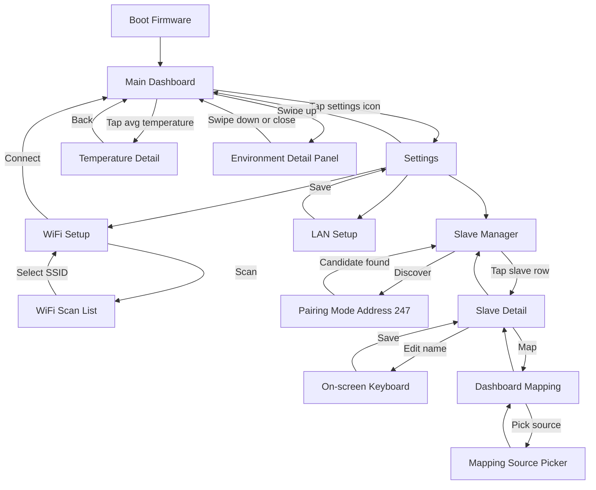
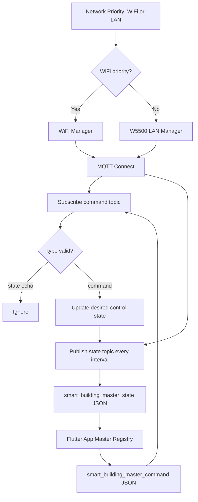
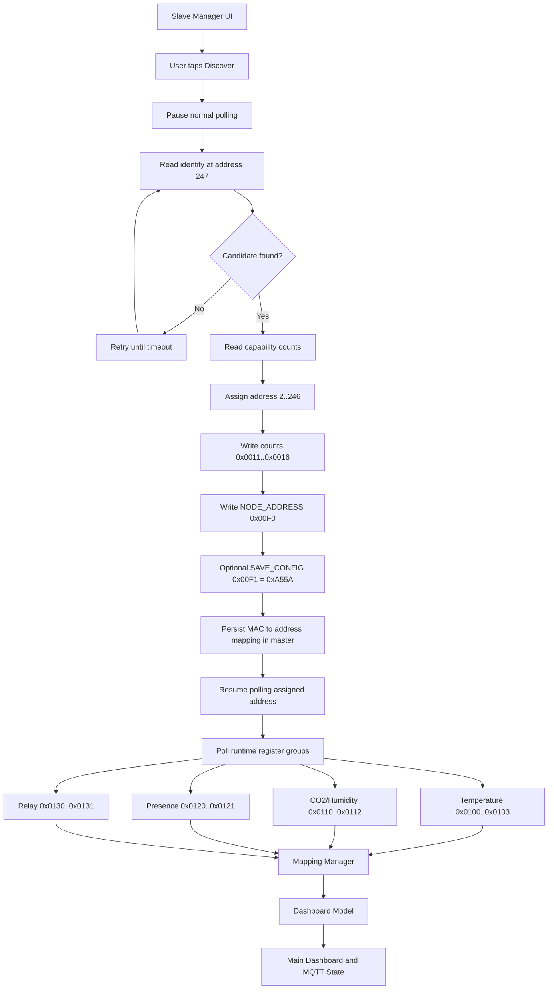

# Smart Building Serial Master

ESP32-S3 based master HMI for a smart building node network. This device is the central touchscreen controller that reads room sensors, maps slave capabilities into dashboard widgets, controls endpoints such as relays, AC, and projector, and publishes state to a Flutter/mobile app through MQTT.

The firmware targets an ESP32-S3 N16R8 board with a 3.5 inch ILI9488 serial SPI display, capacitive I2C touch, W5500 Ethernet, WiFi, MQTT, and an RS485 Modbus RTU field bus.

## What This Device Does

- Shows a 480x320 touchscreen dashboard for room status and control.
- Connects through WiFi or W5500 Ethernet.
- Publishes master/slave state to MQTT for a Flutter app.
- Receives MQTT control commands for lamps, AC, and projector.
- Talks to distributed slave nodes over RS485 Modbus RTU.
- Discovers/pairs slaves at Modbus address `247`.
- Stores master-owned slave names, feature assignment, and dashboard mapping.
- Maps raw slave capability into logical dashboard slots such as temperature points, CO2, presence, AC, projector, and lamps.

## Hardware Overview

| Part | Detail |
|---|---|
| MCU | ESP32-S3 N16R8 |
| Display | ILI9488 3.5 inch TFT, 480x320, serial SPI |
| Touch | Capacitive I2C touch, SDA GPIO8, SCL GPIO9, RST GPIO3 |
| Ethernet | W5500 on dedicated SPI2 bus |
| Field bus | RS485 through MAX3485, Modbus RTU, 19200 8N1 |
| Framework | Arduino with PlatformIO |

## Main Firmware Modules

| Module | Responsibility |
|---|---|
| `src/ui_screens.*` | Dashboard, Settings, WiFi, LAN, Slave Manager, Mapping UI |
| `src/display.*` | LovyanGFX display setup and pin mapping |
| `src/touch.*` | Capacitive touch polling and gesture events |
| `src/wifi_manager.*` | WiFi credentials, reconnect, async scan |
| `src/lan_manager.*` | W5500 Ethernet setup and link state |
| `src/mqtt_manager.*` | MQTT publish/subscribe JSON state and commands |
| `src/rs485_manager.*` | RS485 Modbus master, pairing, polling, control writes |
| `src/mapping_manager.*` | Slave registry to dashboard logical model |
| `src/data.*` | Shared `BuildingState` and persistence |

## UI Flow



## Connectivity Flow - MQTT



Default development topics are configured in firmware or local MQTT secrets. Flutter should filter by JSON `type` because development builds may share one topic for publish and subscribe.

## Connectivity Flow - RS485 Modbus

The current agreed slave wire contract is:

`docs/From_SLave/RS485_Modbus_Slave_Firmware_Contract_V_1_4_0.md`



## RS485 Contract Summary

| Register group | Address |
|---|---|
| Pairing/default slave address | `247` |
| Capability counts | `0x0011..0x0016` |
| Address assignment | `0x00F0` |
| Save config signal | `0x00F1 = 0xA55A` |
| Recovery MAC | `0x00F6..0x00F8` |
| Recovery address | `0x00F9` |
| Temperature | `0x0100..0x0103` |
| CO2/Humidity | `0x0110..0x0112` |
| Presence | `0x0120..0x0121` |
| Relay | `0x0130..0x0131` |
| AC control | `0x0200..0x0202` |
| Projector control | `0x0210..0x0211` |

## Build

Install PlatformIO, then run:

```bash
pio run
```

Upload to the connected ESP32-S3:

```bash
pio run -t upload
```

Open serial monitor:

```bash
pio device monitor -b 115200
```

## Documentation

Start with [docs/README.md](docs/README.md).

Important docs:

- [Functional Specification](docs/FSD_Smart_Building_Master_UPDATED.md)
- [UI/UX Specification](docs/UIUX.md)
- [RS485 Modbus Architecture](docs/Smart_Building_RS485_Modbus_Architecture.md)
- [Connectivity and Dashboard Mapping](docs/Smart_Building_Connectivity_Dashboard_Mapping_Design_UPDATED.md)
- [Flutter MQTT Requirements](docs/Flutter_App_MQTT_Requirements.md)
- [Current Slave Contract](docs/From_SLave/RS485_Modbus_Slave_Firmware_Contract_V_1_4_0.md)

## Current Notes

- Master owns slave names, feature enable state, and dashboard mapping.
- Slave firmware stays RAM-only for address/capability config; master persists MAC to address mapping.
- Temperature point identity is fixed: Point 1 maps to `0x0100`, Point 2 to `0x0101`, Point 3 to `0x0102`, and Point 4 to `0x0103`.
- LUX remains a master/UI future-extension field unless a slave contract revision defines a dedicated LUX runtime register.
