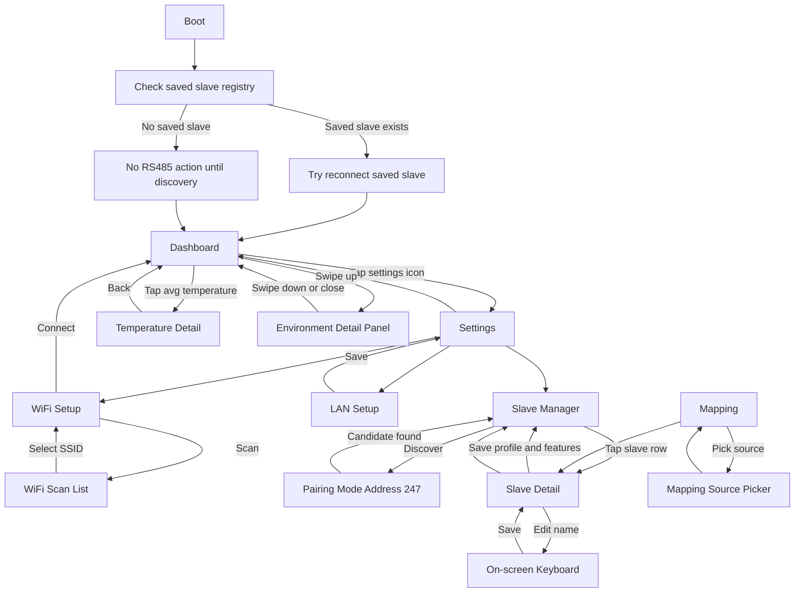
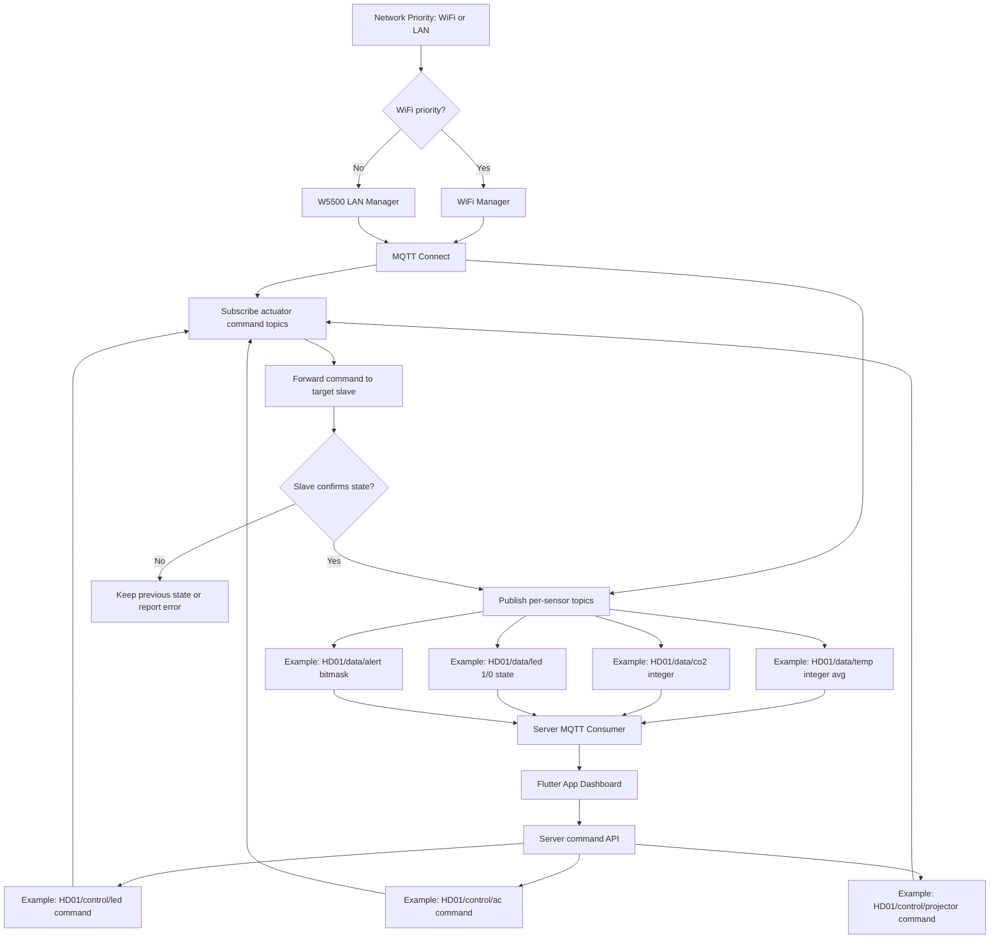
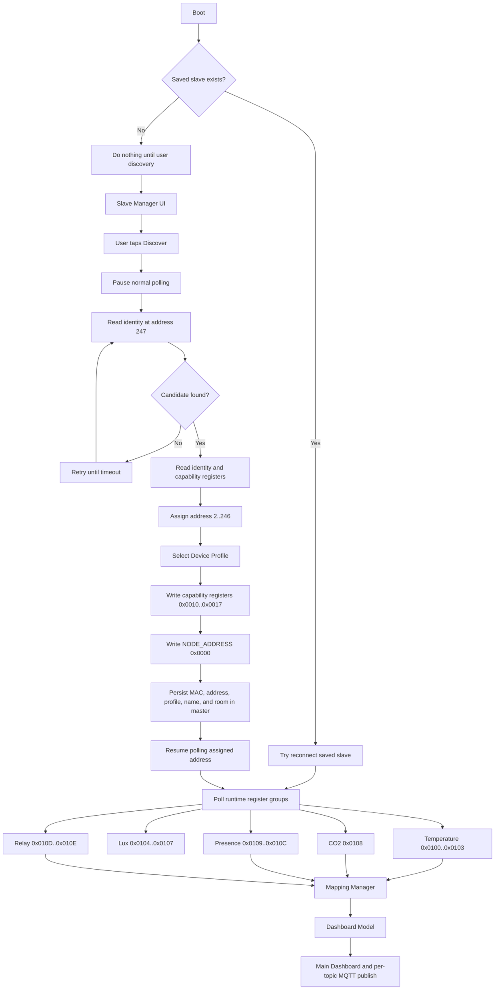

# Smart Building Serial Master

ESP32-S3 based master HMI for a smart building node network. This device is the central touchscreen controller for one room/class: it reconnects known RS485 slave nodes, reads room sensors, controls endpoints such as LED, AC, and projector, and publishes room data to a Flutter/mobile app through MQTT.

The firmware targets an ESP32-S3 N16R8 board with a 3.5 inch ILI9488 serial SPI display, capacitive I2C touch, W5500 Ethernet, WiFi, MQTT, and an RS485 Modbus RTU field bus.

## What This Device Does

- Shows a 480x320 touchscreen dashboard for room status and control.
- Connects through WiFi or W5500 Ethernet.
- Publishes each sensor data type to its own MQTT topic for a Flutter app.
- Receives MQTT control commands for LED, AC, and projector topics.
- Talks to distributed slave nodes over RS485 Modbus RTU.
- Reconnects saved slaves first; discovery/pairing at Modbus address `247` is only needed for new or recovered slaves.
- Stores master-owned slave names, slave assignment, and dashboard mapping.
- Uses Firmware V2.1 slave rules: the master assigns a Device Profile while the slave stays policy-blind.
- Maps raw slave data into logical dashboard slots such as temperature, CO2, presence, Lux, LED, AC, and projector.

## Firmware V2 at a Glance

What changed: Firmware V2 moves away from one large MQTT state topic and multi-main-sensor slave assumptions.

Why: The new model keeps the app simpler, makes each sensor stream easier to subscribe to, and prevents one slave from being configured as unrelated sensor types at the same time.

Implementation effect:

- Startup checks saved slave configuration first. If saved slaves exist, the master tries to reconnect them. If no saved slave exists, it stays idle until the user starts discovery.
- MQTT publishes numeric data topics, for example `HD01/data/temp` and `HD01/data/co2`.
- Simple sensor topics use integer payloads.
- Temperature publishes one integer average Celsius value. `-1` means no valid temperature slot.
- LED and projector publish integer `1` or `0`.
- AC uses the compact `PPTTFFSS` payload for power, target temperature, fan speed, and swing. AC target is clamped to `16..30` degrees Celsius.
- MQTT also publishes `HD01/data/alert` as a decimal bitmask and `HD01/data/active` as retained online state.
- MQTT delivery defaults are scalar data QoS 0 retain true, `active` LWT QoS 1 retain true, and actuator commands QoS 1 retain false.
- Control topics are subscribed separately, for example `HD01/control/led`, `HD01/control/ac`, and `HD01/control/projector`.
- After an actuator command is confirmed by the target slave, the master republishes the related state topic so the app can synchronize.
- Slave selection follows the v2.1 Device Profile model.

## Patch Notes

### V2.6.1

- Updates MQTT topic structure and payload formatting.
- Updates alert handling and alert topic behavior.

### V2.6

- Updates MQTT formatting for clearer per-topic payloads and improved broker command handling.
- Updates the slave contract documentation to align V2.6 RS485 register behavior with the current master/slave protocol.
- Enables AC swing and fan speed control in this version, with swing and fan settings supported end-to-end.

### V2.4

- Replaces the direct MQTT broker keyboard shortcut with a dedicated MQTT Setup summary screen.
- Shows broker host, port, TLS mode, username, masked password, and connection status before editing.
- Persists MQTT broker, port, TLS mode, username, and password in ESP32-S3 NVS and reconnects using the saved values.
- Makes each MQTT field editable only after its card is tapped.
- Loads the last saved WiFi SSID and password from NVS whenever WiFi Setup is opened.
- Keeps WiFi credentials synchronized with the latest connection request.
- Updates FSD and UI/UX documentation for the V2.3 dashboard layout and V2.4 network setup behavior.

### V2.3

- Fixes saved-slave profile selection accidentally clearing all capability assignments and causing the dashboard to show `No Device Active`.
- Releases stale manual dashboard mappings when their saved slave was removed or replaced, while preserving mappings for temporarily offline known slaves.
- Restores saved Device Profile and assignment registers after automatic known-slave recovery.
- Forces one immediate sensor refresh after recovery so restored temperature data becomes visible without waiting for the normal polling cycle.
- Adds profile-driven Slave Detail rows, profile unselect behavior, and saved-slave delete/forget support.
- Improves the adaptive dashboard layout for AC + Projector and Temperature + AC + Projector combinations.
- Enlarges AC temperature `UP` / `DOWN` touch targets while keeping the AC power button compact.
- Adds temporary dashboard-only Swing and Fan cycling controls. These controls are UI dummy states until the RS485 slave contract defines their registers.
- Adds direct RS485 relay debug command support and aligns AC target writes with the current x10 register format.
- Updates Firmware V2.1 recovery, mapping, UI/UX, architecture, and slave-contract documentation.

### V2.2

- Keeps the WiFi scan stability fix from V2.1.
- Simplifies Settings page 2 into the older row-based device settings layout.
- Moves detailed device name and class room editing back into the Device Info screen.

### V2.1

- Fixes WiFi scan busy/start-failed conflicts during reconnect and scan flows.
- Adds the horizontal two-page Settings layout with MQTT and device info controls.

## Hardware Overview

| Part | Detail |
|---|---|
| MCU | ESP32-S3 N16R8 |
| Display | ILI9488 3.5 inch TFT, 480x320, serial SPI |
| Touch | Capacitive I2C touch, SDA GPIO8, SCL GPIO9, RST GPIO3 |
| Ethernet | W5500 on dedicated SPI2 bus |
| Field bus | RS485 through MAX3485, Modbus RTU, 19200 8N1 |
| Framework | Arduino with PlatformIO |

## Main Firmware Modules

| Module | Responsibility |
|---|---|
| `src/ui_screens.*` | Dashboard, Settings, WiFi, LAN, Slave Manager, Mapping UI |
| `src/display.*` | LovyanGFX display setup and pin mapping |
| `src/touch.*` | Capacitive touch polling and gesture events |
| `src/wifi_manager.*` | WiFi credentials, reconnect, async scan |
| `src/lan_manager.*` | W5500 Ethernet setup and link state |
| `src/mqtt_manager.*` | MQTT per-topic publish/subscribe, sensor payloads, and actuator commands |
| `src/rs485_manager.*` | RS485 Modbus master, pairing, polling, control writes |
| `src/mapping_manager.*` | Slave registry to dashboard logical model |
| `src/data.*` | Shared `BuildingState` and persistence |

## UI Flow



## Connectivity Flow - MQTT



Firmware V2.5 generates these exact runtime topics from the saved class name using
`<class_name>/data/<data_type>` and `<class_name>/control/<command_type>`.
Actuator state and command traffic are separated so the server can consume
lightweight numeric state and send commands without self-echo ambiguity.

## Connectivity Flow - RS485 Modbus

The current agreed slave wire contract is:

`docs/From_SLave/RS485_Modbus_Slave_Firmware_Contract v2.md`



## RS485 Contract Summary

| Register group | Address |
|---|---|
| Pairing/default slave address | `247` |
| Capability/profile registers | `0x0010..0x0017` |
| Address assignment | `0x0000` |
| Config/status registers | `0x00F0..0x00F3` |
| Recovery MAC and address | `0x00F4..0x00F7` |
| Temperature | `0x0100..0x0103` |
| Lux | `0x0104..0x0107` |
| CO2 | `0x0108` |
| Presence | `0x0109..0x010C` |
| Relay | `0x010D..0x010E` |
| AC 1 control/status | `0x0200..0x0202`, `0x0206`, `0x0208..0x020A` |
| AC 2 control/status | `0x0203..0x0205`, `0x0207`, `0x020B..0x020D` |
| Projector control/status | `0x0210..0x0212` |

Firmware V2 slave configuration effect:

- Master owns Device Profile selection and persistence.
- Profiles include `TEMP_NODE`, `PRESENCE_NODE`, `CO2_NODE`, `RELAY_NODE`, and `IR_COMBO_NODE`.
- `IR_COMBO_NODE` may expose AC 1, AC 2, and Projector on one IR slave.
- Slave firmware remains RAM-only and policy-blind.

## Build

Install PlatformIO, then run:

```bash
# EDIT_TARGET: README.md - Build
# EDIT_PURPOSE: Show PlatformIO build command
# EDIT_REASON: Developers need a quick command to compile firmware locally
pio run
```

Upload to the connected ESP32-S3:

```bash
# EDIT_TARGET: README.md - Upload
# EDIT_PURPOSE: Show PlatformIO upload command
# EDIT_REASON: Developers need a quick command to flash the ESP32-S3 target
pio run -t upload
```

Open serial monitor:

```bash
# EDIT_TARGET: README.md - Serial Monitor
# EDIT_PURPOSE: Show PlatformIO serial monitor command
# EDIT_REASON: Developers need a quick command to inspect firmware logs
pio device monitor -b 115200
```

## Documentation

Start with [docs/README.md](docs/README.md).

Important docs:

- [Functional Specification](docs/FSD_Smart_Building_Master_UPDATED.md)
- [UI/UX Specification](docs/UIUX.md)
- [RS485 Modbus Architecture](docs/Smart_Building_RS485_Modbus_Architecture.md)
- [Connectivity and Dashboard Mapping](docs/Smart_Building_Connectivity_Dashboard_Mapping_Design_UPDATED.md)
- [Flutter MQTT Requirements](docs/Flutter_App_MQTT_Requirements.md)
- [Current Slave Contract](<docs/From_SLave/RS485_Modbus_Slave_Firmware_Contract v2.md>)

## Current Notes

- Master owns slave names, feature enable state, and dashboard mapping.
- Startup must check saved slave data before discovery. Saved slaves are reconnected first; if none exist, firmware does not auto-assign anything.
- Slave firmware stays RAM-only for address/capability config; master persists MAC to address mapping.
- Firmware V2.1 slave selection uses master-owned Device Profiles.
- Temperature MQTT payload is one integer average Celsius value. `-1` means unavailable.
- LED and projector MQTT payloads use integer `1` or `0`.
- Simple sensor MQTT payloads use integers unless a later spec requires structured data.
